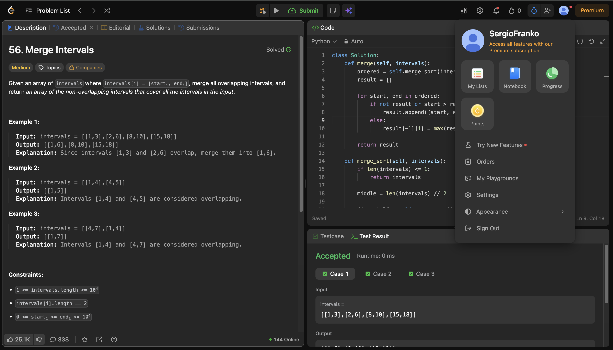
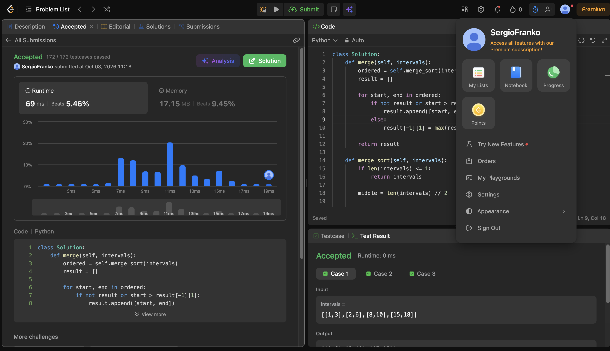
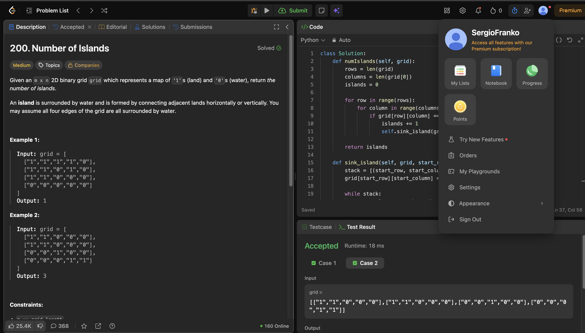
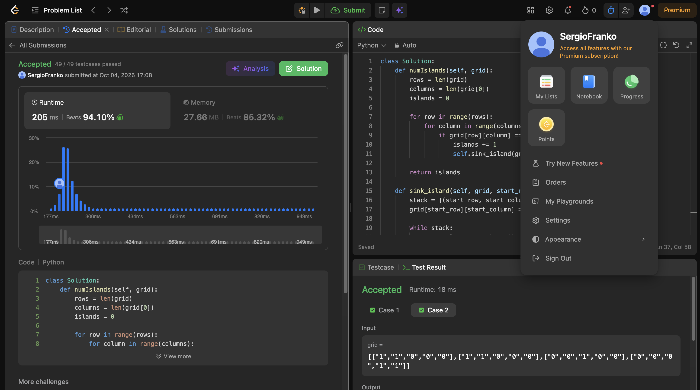
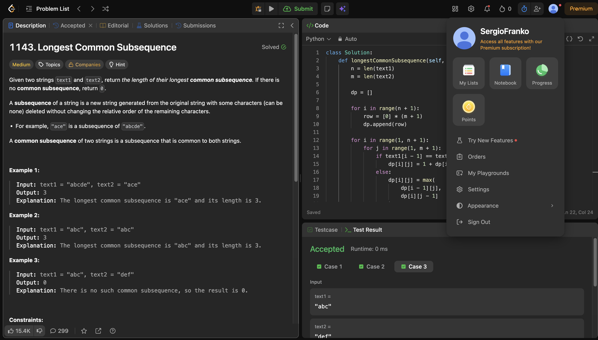
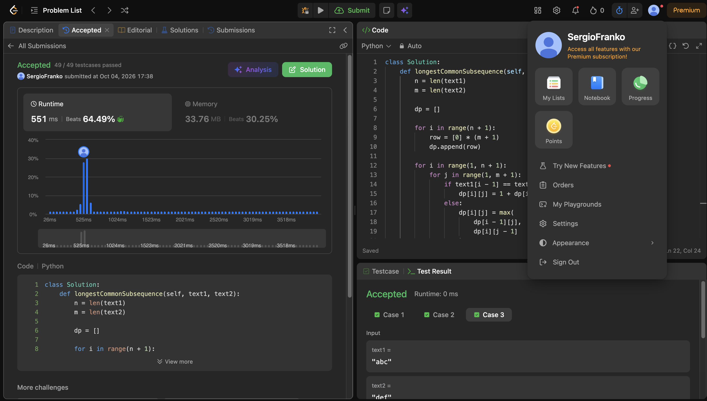
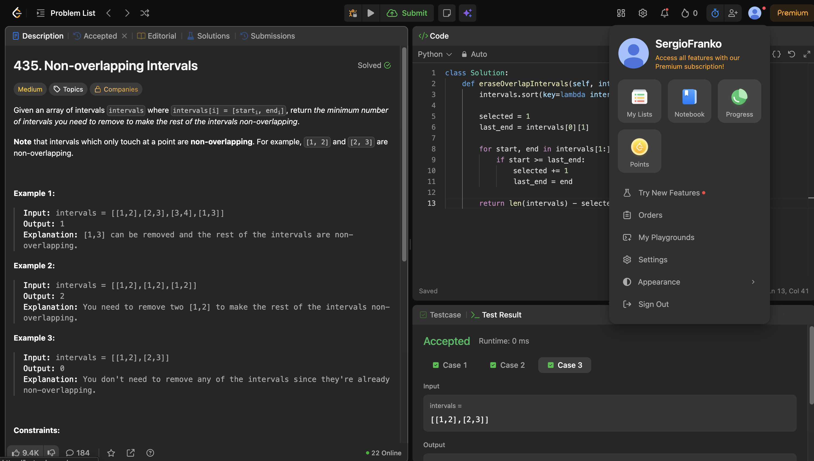
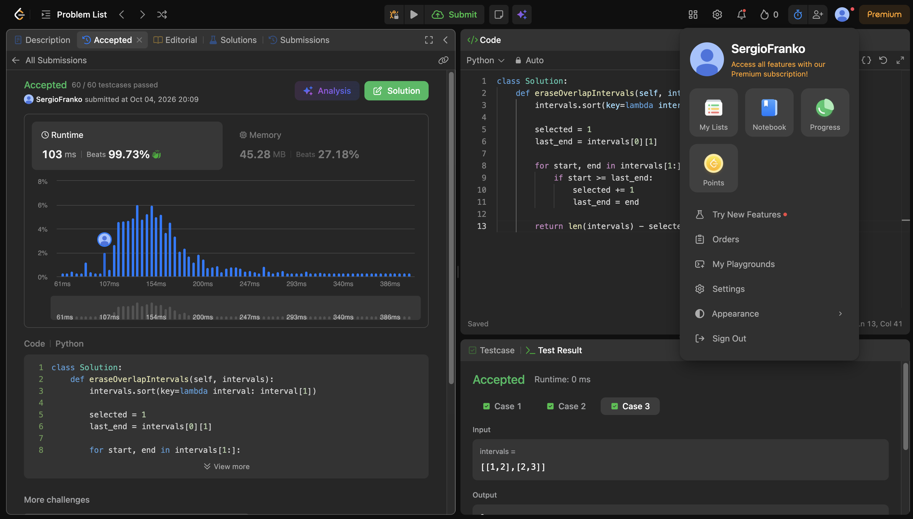
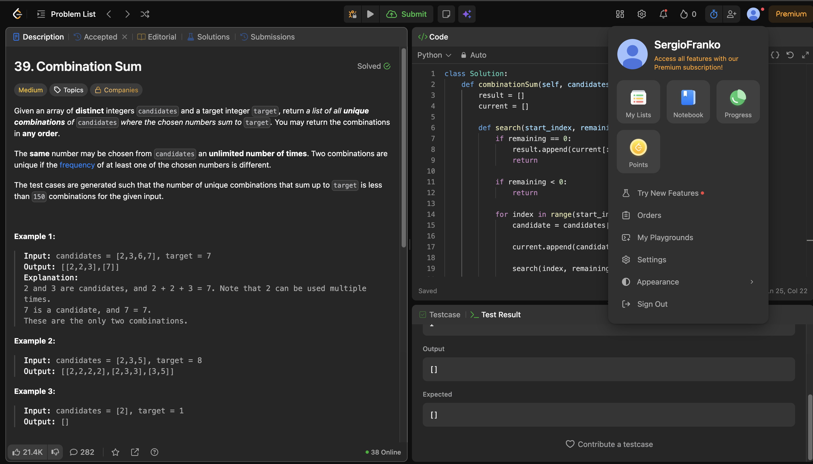
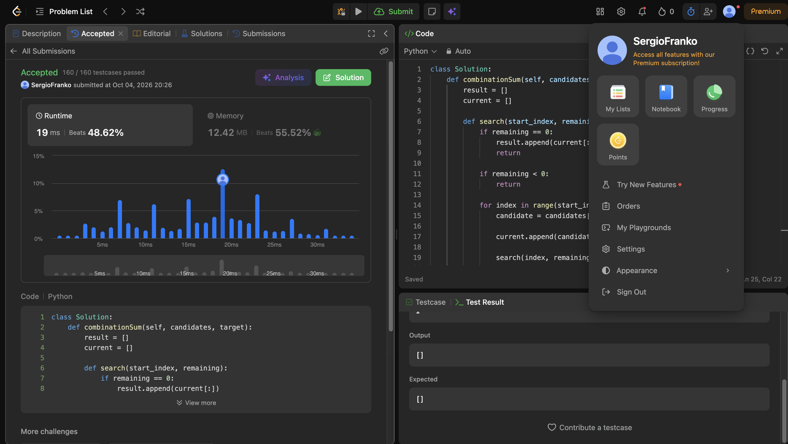

# Taller · Cinco familias en LeetCode

**Curso:** Análisis de algoritmos · ITM · 2026-2  
**Tipo:** clase taller (evaluación)  
**Presentado por:** Sergio Esteban Franco Agudelo

---

## Ejercicio 1 · [56. Merge Intervals](https://leetcode.com/problems/merge-intervals/)

## Familia algorítmica

**Ordenamiento — Merge Sort**

Se implementa Merge Sort manualmente para ordenar los intervalos según su valor inicial. No se utilizan las funciones `.sort()` ni `sorted()`.

Después de ordenar los intervalos, se realiza un recorrido lineal. Si el intervalo actual se superpone o se conecta con el último intervalo guardado, ambos se fusionan. De lo contrario, el intervalo se agrega al resultado.

## Complejidad

- **Tiempo:** `O(n log n)`, debido al ordenamiento mediante Merge Sort. El recorrido para fusionar los intervalos toma `O(n)`.
- **Espacio:** `O(n)`, por las listas auxiliares utilizadas durante el ordenamiento y la fusión.

## Evidencias

### Ejercicio, cuenta de LeetCode y código



### Resultado Accepted



---

## Ejercicio 2 · [200. Number of Islands](https://leetcode.com/problems/number-of-islands/)

## Familia algorítmica

**Grafos — recorrido en profundidad (DFS)**

## Modelo del grafo

La grilla representa un grafo implícito:

- **Vértice:** cada celda cuyo valor sea `"1"`.
- **Arista:** existe entre dos celdas de tierra vecinas en dirección horizontal o vertical.
- **Tipo de grafo:** no dirigido, porque la conexión entre dos celdas funciona en ambos sentidos.
- Las celdas con `"0"` representan agua y no forman parte del grafo.
- Las celdas diagonales no se consideran vecinas.

## Idea de la solución

Se recorren todas las celdas de la grilla. Cada vez que se encuentra una celda de tierra que no ha sido visitada, se incrementa el número de islas y se inicia un DFS iterativo.

El DFS utiliza una pila para recorrer toda la componente conexa. Cada celda visitada se cambia de `"1"` a `"0"`, evitando que vuelva a ser procesada.

Al finalizar, el contador contiene el número de componentes conexas de tierra, es decir, el número de islas.

## Complejidad

Sea `m` la cantidad de filas y `n` la cantidad de columnas:

- **Tiempo:** `Θ(m × n)`, porque cada celda se procesa como máximo una vez.
- **Espacio:** `O(m × n)` en el peor caso, porque la pila puede almacenar una gran cantidad de celdas de una misma isla.

## Evidencias

### Ejercicio, cuenta de LeetCode y código



### Resultado Accepted



---

## Ejercicio 3 · [1143. Longest Common Subsequence](https://leetcode.com/problems/longest-common-subsequence/)

## Familia algorítmica

Programación dinámica.

## Idea de la solución

Se construye una tabla que guarda la longitud de la subsecuencia común más larga para cada combinación de prefijos de las dos cadenas.

La solución utiliza tabulación de abajo hacia arriba. Primero se resuelven los prefijos más pequeños y luego se utilizan esos resultados para calcular los prefijos más grandes.

No se reconstruye la subsecuencia porque el ejercicio únicamente solicita su longitud.

## Estado

Se define:

```text
dp[i][j]
```

como la longitud de la subsecuencia común más larga entre los prefijos:

```text
text1[0..i)
text2[0..j)
```

Esto significa que se consideran los primeros `i` caracteres de `text1` y los primeros `j` caracteres de `text2`.

## Caso base

Si uno de los prefijos está vacío, no puede existir una subsecuencia común:

```text
dp[0][j] = 0
dp[i][0] = 0
```

Por esta razón, la primera fila y la primera columna de la tabla se inicializan con cero.

## Recurrencia

Si los caracteres actuales son iguales:

```text
text1[i - 1] == text2[j - 1]
```

se incluye ese carácter en la subsecuencia:

```text
dp[i][j] = 1 + dp[i - 1][j - 1]
```

Si los caracteres son diferentes:

```text
dp[i][j] = max(dp[i - 1][j], dp[i][j - 1])
```

Se escoge el mejor resultado entre ignorar el carácter actual de `text1` o ignorar el carácter actual de `text2`.

La respuesta final queda almacenada en:

```text
dp[n][m]
```

## Complejidad

Sean `n` la longitud de `text1` y `m` la longitud de `text2`:

- Tiempo: `Θ(n × m)`, porque se calculan todas las posiciones de la tabla.
- Espacio: `Θ(n × m)`, porque se almacena una tabla de `(n + 1) × (m + 1)` posiciones.

## Evidencias

### Ejercicio, cuenta de LeetCode y código



### Resultado Accepted



---

## Ejercicio 4 · [435. Non-overlapping Intervals](https://leetcode.com/problems/non-overlapping-intervals/)

## Familia algorítmica

Greedy.

## Idea de la solución

El problema se puede interpretar como una selección de actividades.

Minimizar la cantidad de intervalos eliminados equivale a maximizar la cantidad de intervalos que pueden conservarse sin solaparse.

Primero se ordenan los intervalos según su punto de finalización. Después se recorren en ese orden y se seleccionan los que no se solapan con el último intervalo aceptado.

La respuesta se calcula de la siguiente manera:

```text
intervalos eliminados = total de intervalos - intervalos seleccionados
```

## Criterio greedy

En cada paso se selecciona, entre los intervalos disponibles, el que termina primero.

Este criterio deja libre la mayor cantidad de espacio posible para aceptar otros intervalos posteriormente.

Después de seleccionar un intervalo, el siguiente se acepta únicamente cuando:

```text
inicio del siguiente >= final del último seleccionado
```

La igualdad está permitida. Por ejemplo, `[1, 2]` y `[2, 3]` no se solapan.

Si el siguiente intervalo comienza antes de que termine el último seleccionado, se descarta porque ambos se solapan.

## Complejidad

Sea `n` la cantidad de intervalos:

- Tiempo: `O(n log n)`, debido al ordenamiento. El recorrido greedy posterior toma `O(n)`.
- Espacio: `O(n)` en el peor caso por el espacio auxiliar que puede utilizar el algoritmo de ordenamiento de Python. El recorrido greedy utiliza `O(1)` de espacio adicional.

## Evidencias

### Ejercicio, cuenta de LeetCode y código



### Resultado Accepted



---

## Ejercicio 5 · [39. Combination Sum](https://leetcode.com/problems/combination-sum/)

## Familia algorítmica

Backtracking.

## Idea de la solución

Se construyen las combinaciones mediante una búsqueda recursiva.

En cada nivel se elige uno de los candidatos disponibles y se resta su valor de la cantidad que falta para llegar al objetivo.

Un candidato puede utilizarse varias veces. Por esta razón, después de elegir `candidates[index]`, la siguiente llamada recursiva puede continuar desde el mismo índice.

Para evitar combinaciones repetidas con distinto orden, la búsqueda nunca vuelve a índices anteriores. Así, si se genera `[2, 2, 3]`, no se genera también `[3, 2, 2]`.

## Estado de la búsqueda

Cada llamada mantiene los siguientes datos:

- `start_index`: primer índice que se puede elegir.
- `remaining`: cantidad que falta para alcanzar el objetivo.
- `current`: combinación construida hasta ese momento.

## Elección

Para explorar una rama se agrega el candidato actual a la combinación:

```text
current.append(candidate)
```

Luego se continúa la búsqueda desde el mismo índice:

```text
search(index, remaining - candidate)
```

Conservar el mismo índice permite reutilizar el candidato las veces que sea necesario.

## Caso exitoso

Cuando `remaining` llega a cero, la combinación suma exactamente el objetivo.

Se almacena una copia de la combinación actual:

```text
result.append(current[:])
```

Es necesario guardar una copia porque `current` continúa cambiando durante el resto de la búsqueda.

## Poda

Cuando `remaining` es menor que cero, la combinación superó el objetivo.

Esa rama se detiene porque todos los candidatos son positivos y agregar más valores no puede convertir el resultado en una suma válida.

## Backtracking

Después de regresar de la llamada recursiva, se deshace la última elección:

```text
current.pop()
```

Esto restaura la combinación al estado anterior y permite probar el siguiente candidato.

## Complejidad

Sean:

- `n` la cantidad de candidatos.
- `t` el valor objetivo.
- `minimum` el menor valor de `candidates`.
- `d = t / minimum` la profundidad máxima aproximada de la búsqueda.
- `S` la cantidad de combinaciones encontradas.

La complejidad es:

- Tiempo: `O(n^d × d)` en el peor caso. El árbol de búsqueda puede tener hasta `n` decisiones por nivel y cada solución puede requerir una copia de hasta `d` elementos.
- Espacio auxiliar: `O(d)` por la pila de recursión y la combinación actual.
- Espacio de salida: `O(S × d)` para almacenar todas las combinaciones encontradas.

La complejidad es exponencial porque el algoritmo debe enumerar las combinaciones posibles.

## Evidencias

### Ejercicio, cuenta de LeetCode y código



### Resultado Accepted

